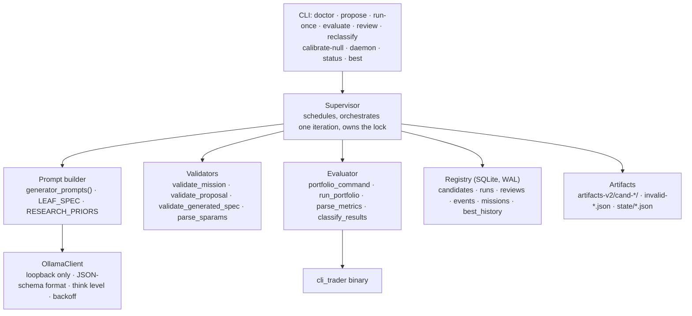
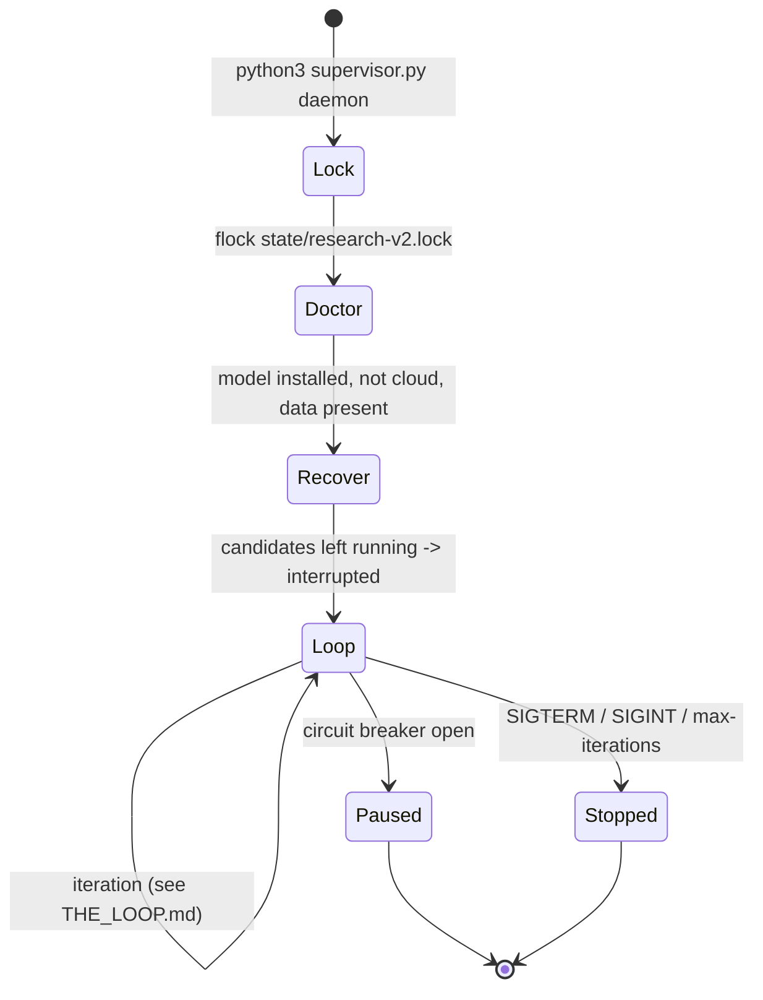

# Architecture

## Components

Everything lives in one Python file, `supervisor.py`, organised in layers that
never call upward:



| layer | responsibility | key functions |
|---|---|---|
| CLI | parse flags, take the single-instance lock, dispatch | `main`, `build_parser` |
| Supervisor | the iteration: schedule a focus (quotas, saturation), get a proposal, validate, reject repeats, evaluate, classify, review, checkpoint | `Supervisor.daemon`, `run_iteration`, `run_once`, `generate_proposal`, `state_context`, `exhausted`, `novelty_rejection` |
| Prompt builder | pure function from ledger facts to (system, user) text | `generator_prompts`, `leaf_reference_lines`, `spec_rule_defs` |
| Validators | reject anything the mission or the evaluator cannot accept, before it costs a backtest | `validate_mission`, `validate_proposal`, `validate_generated_spec`, `normalize_spec_node` |
| OllamaClient | the only network code; loopback URL, proxy bypass, redirect refusal, exponential backoff | `OllamaClient.chat`, `tags` |
| Evaluator | build argv from validated fields only, run, parse the report, apply screens and gates | `portfolio_command`, `run_portfolio`, `parse_metrics`, `classify_results` |
| Registry | durable state with atomic transitions | `Registry.*` |

## Files on disk

```
local_ollama_research/
├── supervisor.py                  everything above
├── missions/local-trend-discovery-v4.json   the active, hashed policy (v2 protocol + finalized search policy; v1/v2/v3 are history)
├── agents/                        the contracts the generator, reviewer and supervisor must honour
├── scripts/bench_generator.py     model x schema benchmark using the supervisor's own validator
├── scripts/install_models.sh, start_ollama.sh
├── state/
│   ├── research-v2.sqlite3        the ledger (WAL mode)
│   ├── research-v2.lock           flock held by the one running supervisor
│   ├── heartbeat-v2.json          status, iteration, focus, last error; rewritten every step
│   ├── null-calibration-v4.json   200 control_random seeds through the folds; the q99 gates
│   ├── best-v2.json               the current best candidate, rewritten when it changes
│   └── archive-*/                 v1 ledger and superseded supervisor.py copies
├── artifacts-v2/
│   ├── cand-<16 hex>/proposal.json     raw model text + parsed proposal + Ollama metadata
│   ├── cand-<16 hex>/spec.json         the rule handed to the C++ executor (generated_spec only)
│   ├── cand-<16 hex>/fold-N/stdout.txt exact evaluator output, one per fold
│   ├── cand-<16 hex>/result.json       fold metrics + classification summary
│   ├── cand-<16 hex>/review.json       reviewer annotation
│   └── invalid-<hash>.json             every rejected model response, with the reason
├── logs/daemon.log                daemon stdout when started with nohup
└── docs/                          this folder
```

`cand-<16 hex>` is the first 16 hex digits of the **config hash**: a SHA-256 of
the canonical configuration (type, strategy, sparams or spec, sizing). Two
proposals with different prose but the same configuration get the same id, and
the second is rejected as a duplicate before any backtest runs.

## Process model



One supervisor process at a time. The lock is a `flock` on
`state/research-v2.lock`; a second `daemon`, `propose`, `evaluate` or
`reclassify` fails immediately with "another supervisor holds". `status` and
`best` open the database read-only and never take the lock, so they are safe
while the daemon runs.

The heartbeat file is the daemon's public face: `running` at start,
`proposing` while a model call is in flight (with the scheduled `focus`),
`idle` between iterations, `error` after a failed iteration, `paused` when a
circuit breaker opened, `stopped` on exit. It carries the model names and the
iteration counter. `status --watch` prints one line from it every few seconds.

Signals are graceful. SIGTERM or Ctrl-C sets a flag; the current iteration
finishes, the heartbeat is written as `stopped`, the lock is released. A
Ctrl-C that lands inside an evaluation marks that candidate `interrupted`
rather than leaving it `running`. On the next start, any candidate still
`running` from a hard kill is marked `interrupted` with classification
`recovered_after_process_exit`; it is never treated as evaluated.

## Provenance

Every evaluated fold records, in the `runs` table and in `result.json`:

- the exact argv;
- the SHA-256 of the mission file (validated against the registered hash at
  startup; a changed mission is a new mission);
- the SHA-256 of the `cli_trader` binary and the git revision of its source;
- stdout and stderr paths, return code, duration, parsed metrics.

That is what makes a `frontier` label reproducible six months later: the
command, the data boundary, the binary and the policy that produced it are all
in the row.

## Persistence

SQLite in WAL mode with `synchronous=FULL`, one commit per transition. Tables:

| table | one row per | key columns |
|---|---|---|
| `missions` | mission id | content hash, path, model, created |
| `candidates` | canonical configuration | `candidate_id`, `config_hash` (unique), status, classification, proposal JSON, summary JSON |
| `runs` | candidate x fold | argv, status, return code, stdout/stderr paths, metrics, hashes |
| `reviews` | reviewer annotation | review JSON |
| `events` | anything that happened | type, payload, optional candidate id |
| `best_history` | change of the current best | candidate id, metric, time |

The `events` table is append-only and is what the circuit breakers, the
scheduler's failure decay and the duplicate detector read. JSON artifacts are
written atomically (temp file + rename) and are the human-readable mirror; the
database is authoritative.
