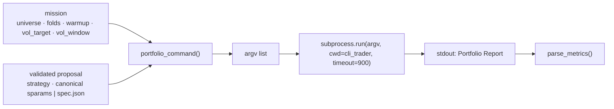

# How the supervisor talks to cli_trader

The supervisor never links against `cli_trader`; it runs the binary as a
subprocess with an argument list, never through a shell, and reads its
standard output. This document is the whole contract.

## Commands the supervisor emits

Only three, and the mission file's `allowed_commands` cannot widen the set
beyond `portfolio`, `backtest`, `list-strategies` and `causality_check`
without failing validation.

### `list-strategies` at startup

```
cli_trader list-strategies
```

The registry prints every family with its provenance line and its parameters
with published bounds, for example:

```
  donchian            Donchian's 4-week rule; the Turtle system
                      entryWindow=55 [5..250], exitWindow=20 [3..120], atrWindow=20 [5..60], atrStopMult=2.5 [0..8]
```

`parse_family_specs` turns that into `{family: {param: (lo, hi)}}` and
`parse_family_catalogue` into `{family: provenance}`. Both feed the validator
and the prompt. There is no hard-coded family list anywhere in the supervisor:
add a family to the registry and it is proposable at the next daemon start.

### `portfolio` per fold



The argv is assembled only from mission fields and validated proposal fields.
Nothing the model wrote reaches it except the canonicalised `sparams` string
(which passed a strict regex and the family's bounds) or the path of a
`spec.json` the supervisor itself wrote. For fold 1 of a family candidate:

```
cli_trader portfolio
  --data-dir  /Users/.../cli_trader/data
  --envs      BTC_USDT:14400,ETH_USDT:14400,XRP_USDT:14400,LTC_USDT:14400
  --start     2018-01-01  --end 2019-12-31
  --warmup-bars 600
  --strategy  donchian
  --vol-target 0.2  --vol-window 30  --weights equal
  --vol-lookback 120  --rebalance 30
  --sparams   atrStopMult=2,atrWindow=20,entryWindow=50,exitWindow=10
```

For a `generated_spec` candidate the last line is instead
`--strategy generated_spec --spec-file artifacts-v2/cand-…/spec.json`.

What each flag means, and why the value is what it is:

| flag | value | why |
|---|---|---|
| `--envs` | the four protocol coins at 4h | the repository's frozen research universe; the eight-coin book cannot run the 2018-19 and 2020-21 folds because two coins start in 2022 |
| `--start/--end` | one of three fixed folds | chronological development folds; the builder refuses any end after `development_end` |
| `--warmup-bars 600` | mission `evaluation.warmup_bars` | indicators warm up on bars before `--start` that are neither traded nor scored; 600 covers the longest window a spec may ask for |
| `--vol-target 0.2` | mission | positions sized to 20% annualised volatility; fixed because the vol target is a leverage dial and would otherwise dominate every comparison |
| `--vol-window 30` | mission | the engine default and the repository protocol's setting; an earlier hard-coded 90 made the loop's numbers incomparable with the registry |
| `--weights equal` | mission | equal sleeve weights; `--vol-lookback/--rebalance` are passed for completeness and are inert under equal weights |
| fees | engine defaults | 0.15% per side plus 0.05% slippage, slightly above the venue's 0.125% |

### The report the supervisor reads

```
===== Portfolio Report =====
Strategy:        donchian on 4 instruments
...
                    portfolio    EW basket       excess
Total return:           15.28%       -74.72%       90.00%
CAGR:                    7.38%       -49.79%       57.18%
Sharpe (ann.):           0.84         -0.36         1.20
  +/-                    0.71
Sortino (ann.):          1.22         -0.51
Max drawdown:            6.38%        88.94%   (close-to-close, see note)

Avg pairwise sleeve correlation: 0.383
--- per sleeve (each traded standalone, for reference) ---
  instrument               Sharpe      B&H    excess   maxDD%   trades   avg wt%
  BTC_USDT                   1.11    -0.02      1.13     12.5       37      25.0
  ...
```

`parse_metrics` reads the first number on the `Sharpe (ann.)`, `CAGR`,
`Sortino` and `Max drawdown` lines (the portfolio column), the third number on
the Sharpe line (excess versus the basket), the sleeve correlation, and sums
the `trades` column over the sleeve rows. Any missing line raises, and the
candidate is killed as an execution failure with the raw stdout kept in
`fold-N/stdout.txt`. The parser is deliberately literal: a format change in
`cli_trader` fails loudly rather than producing a wrong number.

### `causality_check`

The C++ tool `experiments/tools/causality_check` re-runs every **registry**
family on a truncated series and asserts identical signals before the cut.
`generated_spec` is not a registry family, so it is covered instead by
`cli_trader/tests/spec_strategy_test.cpp`, which performs the same truncation
test for a rule using every leaf and is part of `ctest`.

## The `generated_spec` executor

`cli_trader/src/strategy/zoo/spec_strategy.h` is the C++ side of the rule
language. It reads `spec.json`, refuses unknown fields and out-of-range
values with the same limits the supervisor enforces, precomputes one boolean
vector per leaf in `prepare()`, and evaluates the tree at bar `i` in
`onBar()`. It is wired into `makeStrategy` in `main.cpp` under
`--strategy generated_spec --spec-file`. See
[RULE_LANGUAGE.md](RULE_LANGUAGE.md).

## The boundary, restated as code

| the loop cannot | because |
|---|---|
| read 2024+ bars | `portfolio_command` raises on any `--end` after `development_end`; there is no code path that omits `--end` |
| emit `fetch`, `run`, `order`, `balances`, `tournament`, `evolve` | the argv builder only knows `portfolio` and `list-strategies`; the mission allowlist cannot name others |
| pass model text to a shell | every subprocess call is an argument list with `shell=False` |
| hand exchange credentials to the child through the environment | every child runs with `safe_child_environment()`: credential and proxy variables removed, `NO_PROXY=*`. Note the binary still parses `cli_trader/.env` itself on every start; `portfolio` never uses those values, but they are in the child's memory |
| use a cloud model | `OllamaClient` rejects `:cloud` tags and any endpoint other than `http://127.0.0.1:11434` |
| write outside its own tree | artifacts, state and the lock resolve under `local_ollama_research/`; the mission's `source_repo` must resolve to a directory named `cli_trader` and is opened read-only except for `spec.json` paths under artifacts |

The thing the boundary does **not** do is make the historical data itself
unreadable. The candle stores contain 2024+ bars in the same files; the
guarantee is that no command the supervisor can build asks for them.
