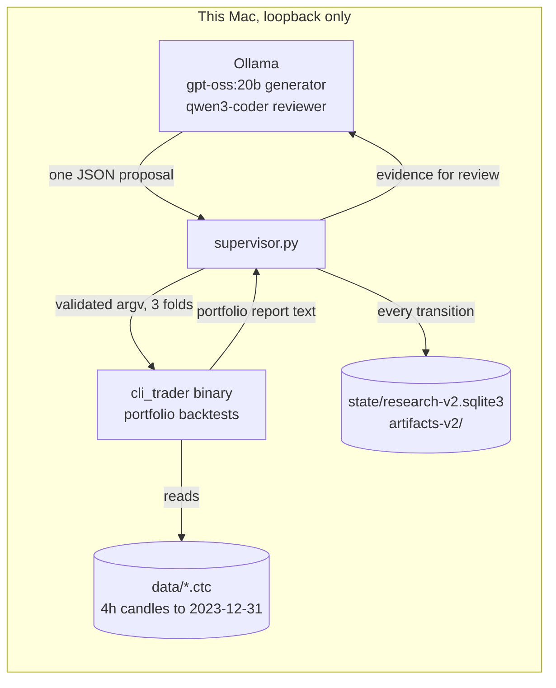

# Overview

## What this is

A research loop that runs unattended on this Mac. A local language model
proposes one trading hypothesis at a time; a deterministic C++ backtester,
`../cli_trader`, evaluates it on fixed historical folds; a Python supervisor
sits between them and does everything that must not be left to a model:
validating the proposal, building the command, parsing the result, applying
the kill rules, recording every step, and refusing to touch anything beyond the
development data.

The model is a source of ideas. It is never the source of a number.



Plain text:

```
   Ollama (local)  <--- prompt + JSON schema ---  supervisor.py  --- argv --->  cli_trader portfolio
   gpt-oss:20b     --- one proposal ----------->  (validate,     <-- report --  (3 folds, 2018-2023)
   qwen3-coder     <--- deterministic evidence -- classify,
                   --- advisory review -------->   record)  --->  SQLite + artifacts
```

## Why it exists

`cli_trader` already has a strategy zoo of 35 families and a tournament that
tuned all of them by genetic search over 53,000 candidates. That search found
that among plausible rules, in-sample ranking carries no out-of-sample
information. A loop that only mutates parameters would repeat that result.

What this project adds is a second axis: the model can compose a **new rule**
in a bounded rule language (`generated_spec`) out of primitives that are
individually causal and unit-tested, including two the zoo never combined
before, a volatility regime and the market factor read from Bitcoin. Every
composed rule is judged by the same evaluator, against the same incumbent,
under the same kill rules as a hand-written one.

## What it will never do

These are enforced in code, not policy documents:

- **Call anything but loopback Ollama.** The endpoint must be exactly
  `http://127.0.0.1:11434`; proxies are bypassed, redirects refused, `:cloud`
  model tags rejected.
- **See data after 2023-12-31.** Every command it builds carries an explicit
  `--start` and `--end`, and the builder refuses any end past the frozen
  boundary. The 2024+ period is contaminated for the registered families anyway
  (see `../../cli_trader/experiments/holdout.json`); clean evidence comes only
  from a forward test registered before it starts.
- **Fetch data, edit source, deploy, or place orders.** The only commands it can
  emit are `portfolio`, `backtest`, `list-strategies` and the causality tool.
  The mission file that allows anything else fails validation at startup.
- **Promote anything.** `frontier` means "worth a human's attention", nothing
  more. No deployment is changed by anything this loop concludes.

## What a good day looks like

Roughly 30 to 40 candidates evaluated per hour, most killed by the basket
screen or the incumbent gate, a few labelled `risk_reducer`, occasionally one
`frontier`. Zero `frontier` for a long stretch is the expected outcome and is
still useful: it is a calibrated null with full provenance, and the leaf-usage
and family-outcome tables tell the next iteration where not to look.
