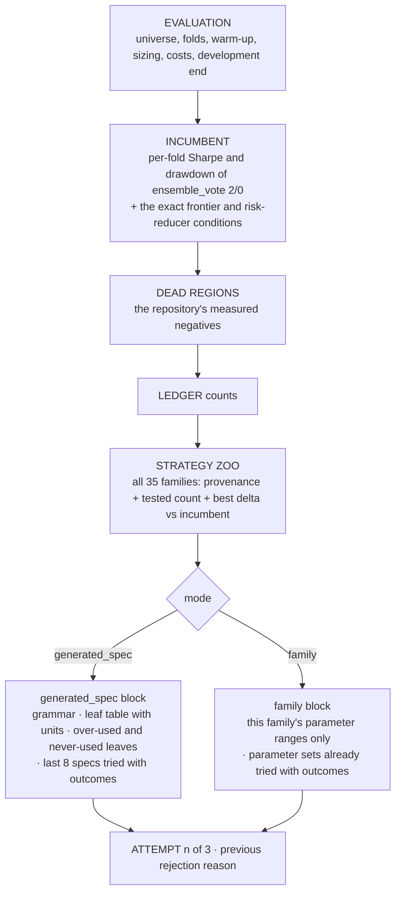

# Prompts and models

## The generator

`generator_prompts(focus, attempt, feedback, ...)` in `supervisor.py` is a pure
function: everything it tells the model comes from its arguments, which are
read from the mission, the live registry and the ledger. It is unit-tested by
asserting that specific facts appear in its output.

### System prompt

One paragraph, the same for every mode with the scheduled mode filled in: return
exactly one JSON object matching the schema; never emit commands, paths, code,
holdout references or deployment advice; the evaluator computes every metric;
propose the scheduled mode only; a mechanism says why prices should behave that
way and restating parameters is not one; do not re-propose anything under
ALREADY TESTED.

### User prompt, in order



Each block exists because of a specific failure earlier in the project:

| block | the failure it answers |
|---|---|
| EVALUATION | windows proposed in daily bars for a 4-hour series |
| INCUMBENT with the gate stated | "do well" is not a target; the model could not aim at a number it was never shown |
| STRATEGY ZOO | the model rebuilt Faber's moving-average rule out of leaves because nobody told it Faber's rule was family nine; the ledger tags say which families are exhausted |
| leaf table with units | thresholds guessed in the wrong unit (percent where a fraction was expected) |
| over-used / never-used leaves | fourteen weekday gates and twenty-five SMA leaves in the first day's specs |
| ALREADY TESTED | 32 of the first day's 74 rejections were duplicates of configurations the model could not see |
| this family's ranges only | dumping every family's bounds cost 2.5k tokens per call, and the model can act on none of them once the schema pins the strategy |
| PREVIOUS ATTEMPT REJECTED | without the reason, retries repeated the error |

Typical size: about 2,400 prompt tokens including the zoo, against about 6,900
before the rewrite.

### Schema

`proposal_schema(mode, family, family_parameters)` returns the JSON schema
passed in Ollama's `format` field, which constrains decoding token by token.
In family mode `proposal_type` and `strategy` are one-value enums and `sparams`
is a string (or the empty-string enum for parameterless families). In
`generated_spec` mode the `spec` field is a recursive rule tree in `$defs`, with
one object shape per leaf listing exactly its required fields and ranges, and
`all`/`any`/`not` nodes. Ollama's grammar honours `$ref` and `anyOf`; this was
verified against gpt-oss:20b before adoption. Prose fields carry minimum
lengths: mechanism 80 characters, reasoning 40.

The validator then re-checks everything the schema promised, because the
schema is a convenience for the model and the validator is the contract.

## The reviewer

After a candidate survives the basket screen, the reviewer model receives the
proposal, its classification and its full summary (fold metrics, incumbent
comparison, null comparison) plus a review schema: `assessment` (promising,
weak, overfit_suspect, duplicate, insufficient_evidence), `mechanism_status`,
lists of robustness and selection-bias concerns, `next_experiment_type`,
`recommended_action` (keep_frontier, keep_as_diversifier, kill,
request_human_review) and a summary. It is told to use only the evidence
supplied and never to override the classification. Its output is stored in
`reviews` and `review.json` as metadata. It has no effect on status.

## Models

| role | model | why |
|---|---|---|
| generator | `gpt-oss:20b` (MXFP4, 13 GB, Apache 2.0) | best proposal diversity per unit of wall clock in the benchmark below; adjustable reasoning effort; fits alongside the reviewer in memory |
| reviewer | `qwen3-coder:latest` (30B-A3B, 19 GB) | fast, reliable structured output; diversity does not matter for a reviewer |

Client settings, in `OllamaClient`: `num_ctx` 16384 (the generator prompt
reached 7,900 tokens at 8,192 and returned empty content 40% of the time),
`think: "low"` for the generator only (cuts gpt-oss's reasoning from about
2,500 characters to about 300 with no loss of validity; the reviewer is not a
thinking model and must not receive the field; `think: false` makes gpt-oss
return empty content every time), temperature 0.7, `keep_alive` 10 minutes,
a 180-second timeout, a minimum interval between requests and exponential
backoff on failures. Flags: `--model`, `--reviewer-model`, `--num-ctx`,
`--generator-think`, `--timeout`, `--llm-min-interval`.

### The benchmark behind the choice

`scripts/bench_generator.py` runs the real generator prompt against any local
model under two schema regimes and scores every answer with the supervisor's
own `validate_proposal`, so "valid" means what the daemon means. Measured
2026-09-05, 24 calls per cell:

| model | loose schema | tightened schema | median latency | distinct proposals |
|---|---:|---:|---:|---:|
| qwen3-coder:30b | 12% | 88% | 6.5 s | 7 of 18 |
| gpt-oss:20b | 21% | 83% | 23 s | 16 of 19 |
| qwen3.8:27b | 79% | 92% | 106 s | 17 of 22 |

Two conclusions drove the design. First, the jump from 12% to 88% for the
same model shows that validity is a schema and prompt property, not a model
property; the tightened schema became the production schema. Second,
qwen3-coder returned byte-identical parameters across repeated draws, which in
a search loop means an endless stream of duplicates, so it was moved to the
reviewer role. qwen3.8:27b is the strongest generator on quality but its
slowest call (227 s) exceeds the default timeout; use it only with
`--timeout 300`.

Re-run with any model that is pulled locally:

```sh
python3 scripts/bench_generator.py --models gpt-oss:20b qwen3.8:27b --reps 3 --out /tmp/bench
```
