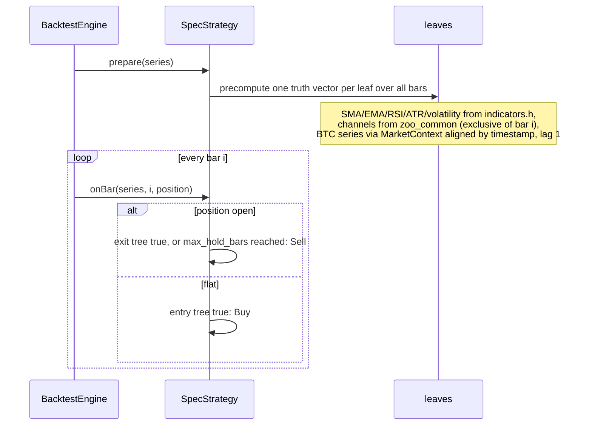

# The rule language (`generated_spec`)

A `generated_spec` candidate is a long/flat strategy written as two boolean
rule trees, `entry` and `exit`, over a fixed set of causal primitives called
leaves. The model composes the tree; the supervisor validates it; the C++
executor in `cli_trader/src/strategy/zoo/spec_strategy.h` runs it through the
same engine, fills, fees and sizing as every hand-written strategy.

Why a rule language rather than letting the model write code: every leaf is
individually unit-tested and causal, so any tree built from them is causal by
construction. That is what lets a rule proposed at 03:00 by a local model be
backtested without a human reading it first.

## Grammar

```
spec   := { "entry": node, "exit": node, "max_hold_bars": int 0..2000 }
node   := leaf
        | { "all": [node, ...] }      1 to 6 children, true when all are
        | { "any": [node, ...] }      1 to 6 children, true when any is
        | { "not": node }
leaf   := { "type": <name>, ...fields }
```

Depth at most 4, at most `limits.max_parameters` leaves in total (12 in the v2
mission). `max_hold_bars` of 0 means no time stop. The supervisor also accepts
`and`/`or` as aliases and indicator-keyed leaves such as
`{"close_above_sma": {"window": 50}}`, and normalises them to the form above
before hashing and before writing `spec.json`.

## Leaves

Windows are in 4-hour bars: 6 is one day, 42 one week, 180 one month. The
threshold's unit differs per leaf, and this table is sent to the model in every
`generated_spec` prompt.

| leaf | fields | threshold means |
|---|---|---|
| `close_above_sma`, `close_below_sma` | window, threshold | percent band around the SMA; 0 is the average itself |
| `close_above_ema`, `close_below_ema` | window, threshold | percent band around the EMA |
| `breakout_above`, `breakdown_below` | window, threshold | percent beyond the prior-window high or low; the channel excludes the current bar |
| `return_above`, `return_below` | window, threshold | fraction: 0.03 is +3% over the window; range −2..2 |
| `zscore_return_above`, `zscore_return_below` | window, threshold, `vol_window`? (default 30) | sigma units: trailing return divided by per-bar volatility times √window. This is tsmom's own statistic; 0.5 is the live default |
| `rsi_above`, `rsi_below` | window, threshold | RSI level 0..100 |
| `relative_volume_above` | window, threshold | this bar's volume over the prior-window mean; 2 is twice normal; range 0..20 |
| `vol_rank_above`, `vol_rank_below` | window, threshold, `rank_window`? (default 250) | percentile 0..1 of realised volatility within its own trailing history |
| `market_zscore_above`, `market_zscore_below` | window, threshold, `vol_window`? | the same z-score computed on BTC_USDT, the market factor, read one bar late. The only leaf that uses information from outside the traded coin |
| `atr_trailing_stop` | window, threshold | ATR multiple k. True while a position is open and close < highest close since entry − k·ATR(window). Range 0.5..10. Meaningful in `exit` only; in `entry` it is always false |
| `weekday` | day | 0..6 in UTC, Sunday = 0 |
| `green_candle`, `red_candle` | none | close above, or below, open |

Secondary windows are accepted only on the leaves listed for them. A
`vol_window` on an RSI leaf is rejected by both the supervisor and the
executor, so a stray field can never silently change what a rule means.

## Example

The best candidate the loop produced on its first day, and a version of it
using the newer leaves:

```json
{
  "entry": {"all": [
    {"type": "breakout_above", "window": 20, "threshold": 0},
    {"type": "close_above_sma", "window": 50, "threshold": 0},
    {"type": "rsi_above", "window": 14, "threshold": 70}
  ]},
  "exit": {"any": [
    {"type": "close_below_sma", "window": 20, "threshold": 0},
    {"type": "rsi_below", "window": 14, "threshold": 30}
  ]},
  "max_hold_bars": 0
}
```

```json
{
  "entry": {"all": [
    {"type": "zscore_return_above", "window": 90, "vol_window": 30, "threshold": 0.5},
    {"type": "market_zscore_above", "window": 90, "threshold": 0.0},
    {"type": "vol_rank_below", "window": 30, "rank_window": 250, "threshold": 0.9}
  ]},
  "exit": {"any": [
    {"type": "atr_trailing_stop", "window": 20, "threshold": 3.0},
    {"type": "zscore_return_below", "window": 90, "vol_window": 30, "threshold": -0.5}
  ]},
  "max_hold_bars": 0
}
```

The second reads: enter when the coin's own trend is significant, Bitcoin's
trend agrees, and volatility is not in its top decile; exit on a three-ATR
trailing stop or when the trend statistic turns significantly negative.

## How the executor evaluates it



Every leaf except one is a plain lookup into a vector computed from bars at or
before `i`. The exception is `atr_trailing_stop`, which needs the position: the
executor precomputes `k · ATR(i)` and compares the close against the engine's
`highestClose`, which the engine has already updated with bar `i` before asking
the strategy, exactly as `DonchianStrategy` does. `market_zscore_*` reads the
BTC store through `zoo::MarketContext`, aligned by timestamp to the bar one
period earlier, so a live altcoin sleeve never needs a Bitcoin bar another
process has not fetched yet.

## Causality and tests

`cli_trader/tests/spec_strategy_test.cpp` (in `ctest`) asserts:

- the z-score leaves reproduce `TsmomStrategy`'s sigma-threshold decisions
  signal for signal;
- the trailing stop fires exactly when close < high-water − k·ATR, and never
  opens a position from an entry tree;
- a rule using every leaf gives identical signals whether or not the bars after
  the decision bar exist (truncation invariance), flat and in position;
- unknown fields, misplaced secondary windows and out-of-range thresholds throw.

That last test is the rule language's causality check. The repository's
`causality_check` tool iterates registry families only, and `generated_spec`
is constructed from a file, not the registry.

## Adding a leaf

Four places, in this order:

1. `spec_strategy.h`: a `LeafKind`, its parse branch with range checks, its
   `prepareNode` case (and `evalNode` if it needs the position).
2. `supervisor.py` `LEAF_SPEC`: fields, optional secondary windows, threshold
   range, and the unit sentence the model will read. The validator, the JSON
   schema (`spec_rule_defs`) and the prompt all derive from this one entry.
3. `spec_strategy_test.cpp`: add it to the every-leaf causality rule and, if
   its semantics are non-trivial, a direct check.
4. `agents/GENERATOR.md`: the leaf table.

A leaf must be computable from OHLCV at or before the decision bar, or from a
reference series aligned by timestamp with a lag. Anything that needs the
future, a network, or a file the supervisor did not write does not belong here.
