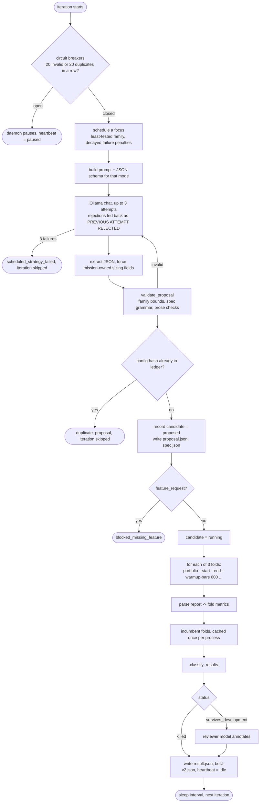
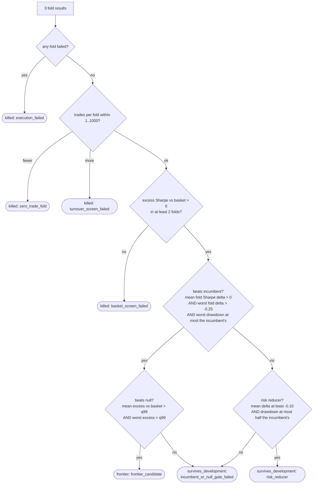

# The loop

One daemon iteration, from scheduling a focus to writing the checkpoint. The
interval between iterations is `--interval` seconds (30 by default) and the
model call is the only slow step: a fold backtest takes about 20 milliseconds.



Plain text:

```
 breakers? -> schedule focus -> prompt+schema -> Ollama (<=3 tries) -> validate -> dedupe
   -> record proposed -> run 3 folds -> parse -> compare to incumbent + null -> classify
   -> review if it survived -> checkpoint -> sleep -> repeat
```

## 1. Circuit breakers

Before anything else the daemon counts consecutive `invalid_proposal` and
`duplicate_proposal` events since the last `proposal_recorded`. Twenty of
either (mission `limits`) opens the breaker: a `daemon_paused` event, heartbeat
`paused`, and the loop exits. This is what a broken prompt, a wedged model or
an exhausted family looks like, and the right response is a human, not another
thousand iterations. Restart the daemon to close the breaker.

## 2. Scheduling

The mission's `search_policy.preferred_sequence` lists the modes and families
the loop may propose. The scheduler picks the one with the lowest score:

```
score(family) = candidates recorded for it
              + 10 x sum of exp(-age_hours / 24) over its focus failures
              + 10 x sum of exp(-age_hours / 24) over its duplicate rejections
```

so the least-tested family goes first, a family that just failed or just
produced duplicates is pushed back by about ten candidates' worth, and the
penalty fades over a day. There is no rule that retires a family permanently;
an earlier version had one and the rotation collapsed to a single mode within
three hours.

`feature_request` is excluded from the rotation unless the mission sets
`search_policy.schedule_feature_requests`. It produces notes for a human, not
runnable candidates, and twenty of them accumulated in one afternoon when it
was scheduled.

## 3. Proposal

`generator_prompts()` builds the system and user text from ledger facts (see
[PROMPTS_AND_MODELS.md](PROMPTS_AND_MODELS.md)). `proposal_schema()` builds a
JSON schema for the mode: in family mode `strategy` is a one-value enum and
`sparams` a string; in `generated_spec` mode the rule tree is described
recursively with one exact object shape per leaf. Ollama constrains decoding to
the schema, so most malformed answers cannot be produced at all.

Up to three attempts per iteration. Each rejection is appended to the next
attempt's prompt as `PREVIOUS ATTEMPT REJECTED: <reason>`. Every rejected
response is saved as `artifacts-v2/invalid-<hash>.json`. Three failures record
`scheduled_strategy_failed` and skip the iteration.

The supervisor overwrites `vol_target`, `weights`, `vol_lookback` and
`rebalance` with the mission's values before validation. Sizing is a policy,
not a hypothesis, and letting the model choose it would turn every comparison
into a leverage comparison.

## 4. Validation and canonicalisation

`validate_proposal` checks, in order: required fields; prose lengths, and that
the mechanism is at least eight words of prose rather than a list of leaf
names; the strategy exists in the live registry (`list-strategies`, read at
startup, never a hard-coded list); every `sparams` entry names a parameter of
that family and sits inside its published bounds; for specs, the grammar and
every leaf's fields, units and ranges; no reference to holdout, deployment or
2024+ resources in the prose.

The surviving configuration is canonicalised (sorted parameters, `%g` number
formatting, normalised spec tree) and hashed. That hash is the candidate id.
If it already exists, the proposal is a duplicate and no backtest runs.

## 5. Evaluation

For each of the three folds the supervisor builds one `portfolio` command
(see [CLI_INTERFACE.md](CLI_INTERFACE.md)) and runs it with a 900-second
timeout. Output is parsed with fixed regular expressions into Sharpe, excess
Sharpe versus the basket, CAGR, Sortino, drawdown, sleeve correlation and the
per-sleeve trade count. A fold that returns non-zero, times out, or prints a
report the parser cannot read is an execution failure and the candidate is
killed with the raw output kept.

The incumbent (`ensemble_vote enterVotes=2,exitVotes=0`, the live book's rule)
is run through the identical three commands once per process and cached.

## 6. Classification



Three numbers in that diagram are design choices and are worth knowing:

- **0.25 tolerance on the worst fold.** A two-year fold has a Sharpe standard
  error near 0.71. Strict per-fold dominance vetoed candidates that lost one
  fold by 0.02 while winning the others by more than one full unit; a third of
  a standard error is the tolerance adopted.
- **q99 of the null.** `calibrate-null` runs `control_random` (coin-flip
  entries, 20-bar hold) through the folds for 200 seeds and stores the 99th
  percentile of mean and worst excess Sharpe versus the basket. The current
  v2 values are 0.42 and 0.21. A candidate below them is indistinguishable
  from a lucky random trader with the same sizing.
- **Half the drawdown for `risk_reducer`.** The live book's own justification
  is drawdown, not alpha; a rule that keeps the Sharpe and halves the drawdown
  deserves a label rather than "gate failed".

`reclassify` re-runs this decision over every stored survivor after a rule or
calibration change; stored fold metrics are reused, nothing is re-backtested.

## 7. Review

A candidate that survives the basket screen is handed to the reviewer model
with its proposal, classification and full summary, and a fixed review schema:
assessment, mechanism status, robustness and selection-bias concerns, next
experiment type, recommended action. The review is stored as metadata. It has
no vote: the classification above is the only authority.

## 8. Checkpoint

`result.json` is written, `best-v2.json` is rewritten if the candidate is the
new best by mean Sharpe versus the incumbent, the heartbeat goes to `idle`,
and one JSON line describing the iteration goes to stdout. Then the daemon
sleeps `--interval` seconds.

## Failure paths

| what happened | recorded as | candidate status | daemon |
|---|---|---|---|
| model returned no JSON or invalid JSON | `invalid_proposal` | none | retry, up to 3 |
| Ollama request failed or returned empty content | `proposal_request_error` | none | retry with backoff, up to 3 |
| three attempts failed | `scheduled_strategy_failed`, `iteration_skipped` | none | next iteration |
| same configuration already tested | `duplicate_proposal`, `iteration_skipped` | none | next iteration |
| a fold failed or timed out | `candidate_classified` | `killed / execution_failed` | next iteration |
| exception inside evaluation | `candidate_evaluation_exception` | `killed / evaluation_exception` | next iteration |
| Ctrl-C during evaluation | `candidate_interrupted` | `interrupted / operator_interrupt` | stops |
| process died mid-evaluation | `candidate_recovered_interrupted` (next start) | `interrupted / recovered_after_process_exit` | continues |
| 20 invalid or 20 duplicates in a row | `circuit_breaker_open`, `daemon_paused` | none | exits, heartbeat `paused` |
